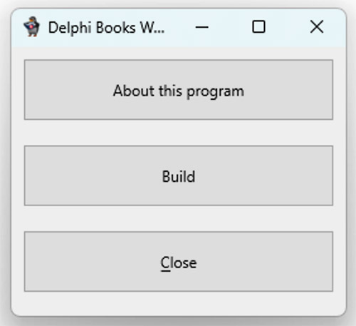
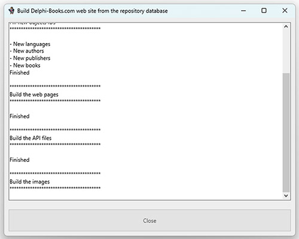

# Web Site Builder

[Cette page en français.](LISEZMOI.md) [Home](../README.md)

This folder contains the program for generating the site from the local database.

WSBuilder is available for Windows and Mac. It should be run from this folder on your computer, maintaining the code repository tree structure.

The program is used to feed the [delphi-books.com](https://delphi-books.com) site, but can also be used locally to test modifications to the database or page templates.

**Warning**: if you make a PULL REQUEST, modifications made with this program will be rejected. If you modify the database, send the changes without going through WSBuilder!

## For Windows

Simply run the DelphiBooksWebSiteBuilder.exe file.

## For Mac

Unzip the DelphiBooksWebSiteBuilder-Mac.zip file in the same folder to obtain the application, then click on it to launch it.

## Instructions

### About the program

The "about" button displays program version and copyright information.

### Build the site

The "build" button triggers (local) updating of the website.

It loads :
- the database from the /database/datas folder
- the page templates from /site-templates/templates folder

Checks and completes the database.

It saves :
- site files (html, json, xml, jpg, ...) in the /docs folder (for hosting on GitHub Pages)
- modified database elements

### Exit program

Use the "Close" button to exit this program.
